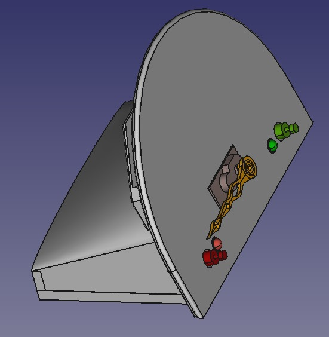
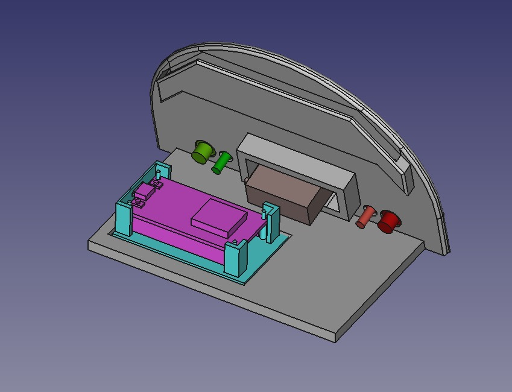
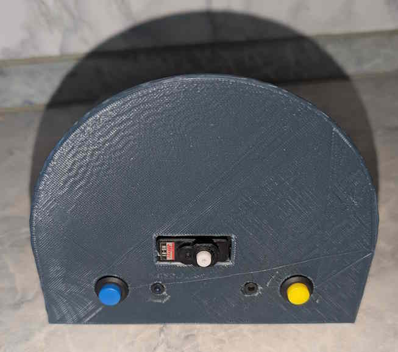
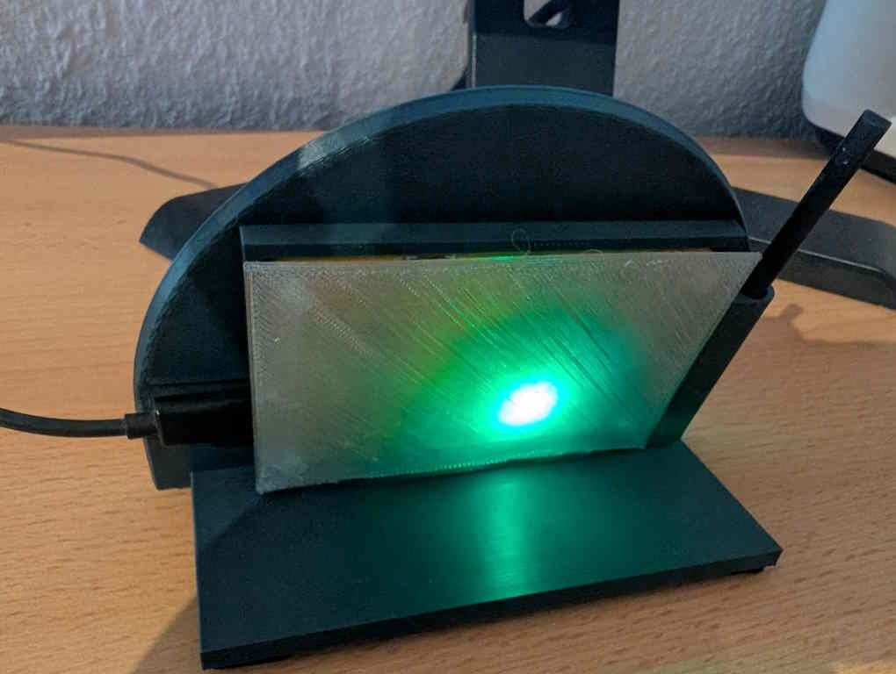

## Case design

With not much more tools than a 3d-Printer, I wanted the case to be as simple as possible and easily printable on a 15x15cm printer. Instead of a movement, I directly expose the servo motor and mount a dial on it. The clock face also needed space for the two buttons and LEDs.

The inside needed space to mount those things, plus the ESP board. The Board is mounted on a separate riser to simplify both printing and assembly, and maybe switch to a different type of board.

A slot to add a 11cm wide printed photo was added to the back.

### 3D Printing

Four parts need to be printed:

- Main case with clockface
- Cover
- ESP mounting plate
- Clock Dial

Case, Cover and mounting plate are simply glued together with hot glue. (Yes, _could_ have gotten a more elegant solution here...)

The Dial is screwed on the shaft of the servo using the screw that came with the motor

The front will be covered with a printed [clock face](../Images/).

## Digital Twin

The model for the version with a digital display uses a transparent back to hold the display in place and keep the included RGB LED visible. There is also a holder for a pen that came with my display.

## Individual Adjustments

In case you want to do your own improvements and adjustments, I included the [FreeCAD](https://www.freecad.org/) model file in this repo. It's a free and open source CAD system.
