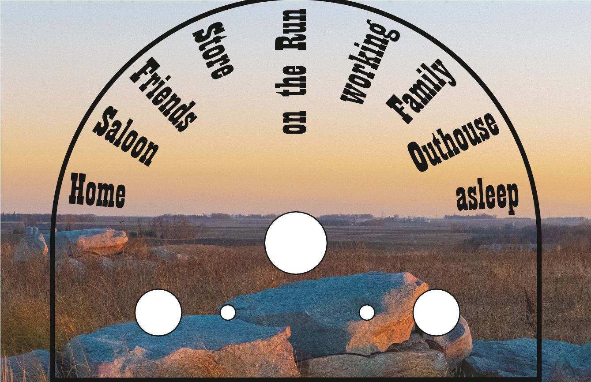
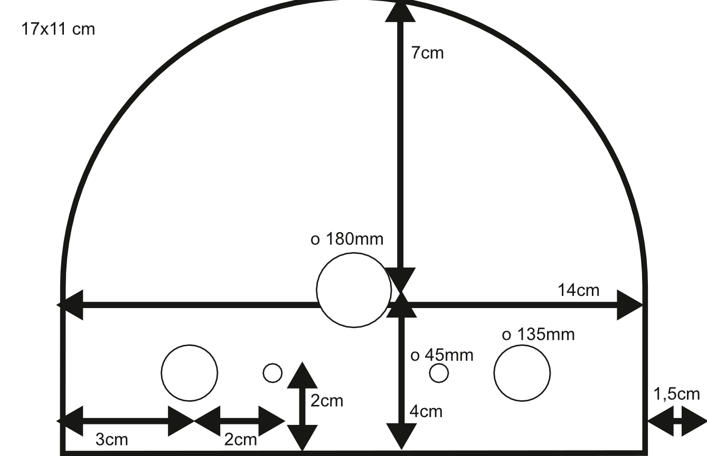

## Images

The Magic Clock gets its appearance mostly from two images: The clockface and the (optional) picture in the picture holder on the back.

Both are created as 11x17cm images that is available as a standard photo size (and can be printed out on actual photo stock) and roughly matches the 15x15cm limits of my 3d-Printer.

They were created using [Scribus](https://www.scribus.net/), free and open source DTP software, in case you want to build on my pictures and go from there.

Or if you want to use your favorite graphic suite, you can use these measurements as a guideline:

### Sources

#### Font
[Playbill](https://learn.microsoft.com/de-at/typography/font-list/playbill), 75pt, part of the MSOffice package

#### Image

I used images available on Wikimedia Commons, so I won't include them in this repo. You can get them here if you want to use them, too.

* Sidewall (USA), 1905–15, Made by Janeway & Co. Inc. [2048px-Sidewall_(USA),_1905–15_(CH_18500779).jpg](https://commons.wikimedia.org/wiki/File:Sidewall_(USA),_1905%E2%80%9315_(CH_18500779).jpg) Wikemedia Commons, Public Domain

* Evening on the prairie, Rock County, Minnesota [4096px-Evening_on_the_prairie,_Rock_County,_Minnesota.jpg](https://commons.wikimedia.org/wiki/File:Evening_on_the_prairie,_Rock_County,_Minnesota.jpg) Wikimedia Commons, Creative Commons Attribution 2.0 Generic license, work by Sank63 from [https://www.flickr.com/photos/gsankary/53341044031/]

#### Dummy-User
The person used here is a dummy user profile picture created by [https://randomuser.me/photos](https://randomuser.me/photos)
