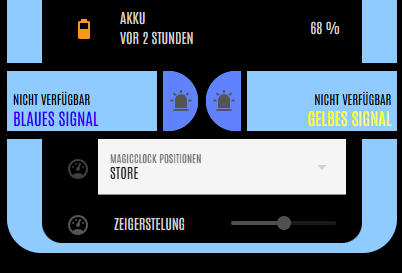

## Home Assistant

I had already a working Home Assistant, so it was just natural to use it as the central hub to control the magic clock.

Home Assistant can use the companion app on users phones to collect location data and access all other kind of information to factor into your magic clock and on the other end can use [esphome](../esphome/readme.md) to connect and control the clock.

When connected to the device, it will expose these entities to Home Assistant:

- A number setting that controls the angle of the clock dial. The servo has a range of 180° that is represented as a number range from -100 to 100 with 0 being the middle position.
- 2 switches representing the LEDs
- 2 binary sensors representing the buttons.

Now we can unleash the power of Home Assistant... The yaml files in this directory will show you how I did it.

### Helpers

[helper.yaml](helper.yaml) sets up an input select helper listing all the labels available on the clock face and an input boolean helper to quickly enable or disable automatic movement of the clock dial.

### Dial control

[automation_set_dial_position.yaml](automation_set_dial_position.yaml) connects the selection helper to the servo motor. Each time a new option is selected by the helper, this automation will set the angle of the servo motor accordingly. The stepping for the angle control number entity in theory should be +-100 / number of labels, but in the end depends on your clockface design. Use try and error to find out which values look good and point exactly at your labels.

[automation_set_dial_label.yaml](automation_set_dial_label.yaml) This is where the magic happens. All kind of input is used to decide which label to point to:

- GPS fencing from the companion app will result in a location based labels such as "shop", "friends" or "bar"
- Events from my Google calendar will show "Working" while in meetings
- Hue lamps switched on or off are used as a substitute presence indicator for certain rooms.
- A different (existing) status helper signals sleep or awake and general presence or absence.
  If you want to use my design and turn it into a weather station or something completely different, this is the spot where you need to change to your logic.

### Buttons and LEDs

The clock has two buttons (blue and yellow) that toggle the two LEDs next to the buttons on the clockface. (also blue and yellow) Nice but not spectacular. But we can turn that into a low level 2-way communication device:

[dashboard_signal_buttons.yaml](dashboard_signal_buttons.yaml) gives an example for how to add buttons to your Home Assistant Dashboard that will

1. Show the LED status in your dashboard
1. Allow to remote control the LEDs manually

Feel free to add any semantics to those two lights. Switch on the yellow light for "Dinner is ready" and the blue one for "call me" or whatever fits the point of your magic clock.

[automation_show_clock_signal.yaml](automation_show_clock_signal.yaml) To make sure I notice when the buttons on the clock are pressed, a Hue lamp in the living room will match the color of the pressed button. Phone notifications through the Companion App or Emails or logging would go in here, too.

### Source

You can get Home Assistant at [https://www.home-assistant.io/](https://www.home-assistant.io/), but you also could use any other way of controlling the clock by using a different esphome configuration.
