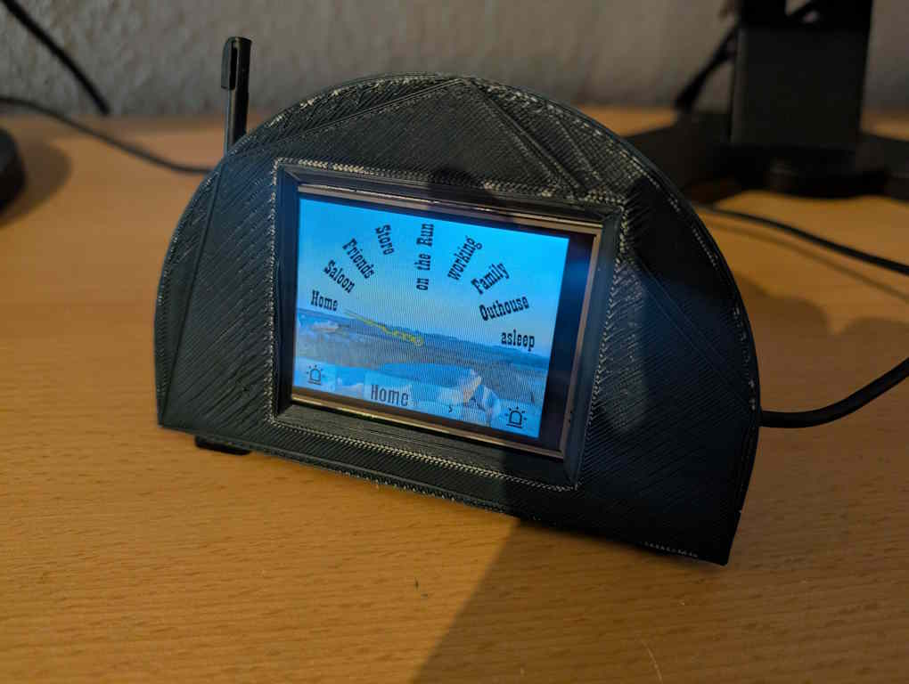

# Magic Clock for Home Assistant

If you ever read or saw Harry Potter, you may remember the Weasley Family's magic clock that showed the whereabouts of all family members.
And of course you wanted something like that, too.

**Good News**: I built one and can share my work with you.

**Bad news**: You probably need to adjust each part of my work to your requirements. And it's several parts that need to work together.

The clock was meant to give my wive who had to go overseas for several months a way to connect back to me and home by getting live updates, but also make her presence felt by switching the living room light colors.

## Overview

This project uses a ESP32 to control a servo motor connected to a clock dial to display a persons current status. That status is based on several inputs like GPS data from phone, calendar data, a sleep state sensor or currently switched on Hue devices.

A local Home Assistant instance collects those data and decides where to point the clock dial, indicating locations like office or school, but also current activities like sleeping.

In addition, intended as a really simple way of two-way conversation, two switches control two LEDs that can be toggled on or off. The LED status is relayed back to the Home Assistant server and can be monitored and controlled from there, too.

## Requirements and Sub-Projects

It turned out that you need to combine several trades to build a magic clock. On the other hand, none of them went into the really advanced stuff and all the tools needed are free and Open Source.

- _[Smart Home Platform](homeassistant/)_: Home Assistant is used to collect all necessary data and control the clocks servo motor.
- _[CAD and 3D-Printing](CAD/)_: The case for the clock was designed using FreeCad
- _[Firmware and Network](esphome/)_: The EspHome-Project is far the easiest way to generate a firmware for ESP32 or similar that connects to Home Assistant
- _[Hardware](schematics/)_: Some sketches of the schematics
- _[Graphics & Design](Images/)_: Templates and measurements to help you designing your front plate for the magic clock. I used Scribus.

Detailed descriptions can be found in those folders.

## 3D-Printing

STL-Files for 3D-Printing the case are available on [printables.com](https://www.printables.com/model/1224639-magic-clock)

I will be happy to see your make results or comments there, too.

# Digital Twin

As an alternative to the actual clock with servo and physical dial, there is a simplified version included that uses a digital display. Building is much simpler as the only step neccessary is to clip an easily available esp32-2431S028 (or CYD - cheap yellow display) into a 3D-Printed parts (printable without any supports), flash the firmware and done. It uses a development board that contains both display and controller and the same Home Assistant back end as its "bigger" brother.

But with one exception: The included esphome configuration acts as a remote control for a "big" version. So it connects to the LED entities provided by the controlled device and has a drop down field to set the input_select entity in the backend that drives the clock hand. If you want to use _only_ a digital version you need to edit the firmware configuration to either provide entities for the two LEDs or add helpers in the back end and use those.

STL-Files for 3D-Printing the case of the digital twin are available on [printables.com](https://www.printables.com/model/1242070-magic-clock-with-display)

# Disclaimer

This is my personal hobby project and it is completely tailored to what I had already running, knew how to do or was ready to learn. Feel free to use my work as inspiration for your own and I would love to learn what you ended up making.
