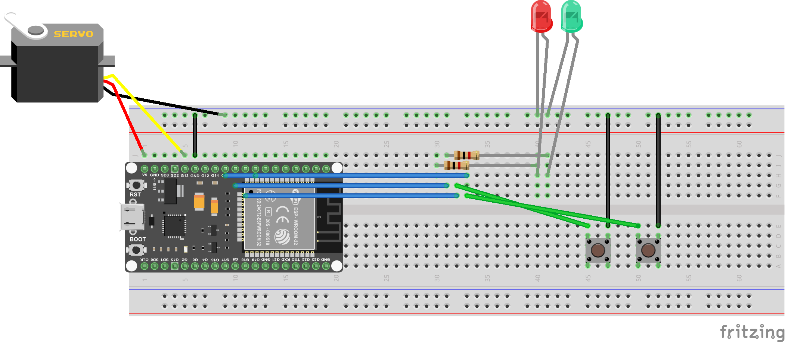
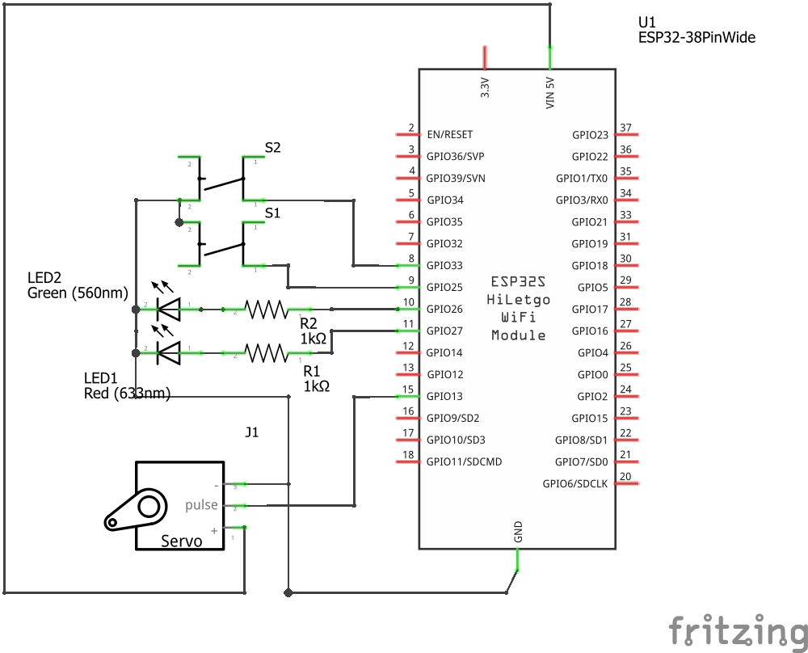
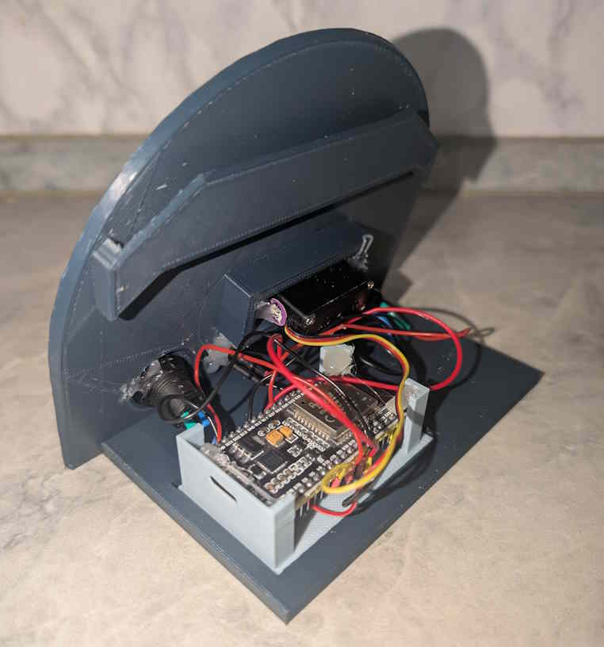

## Electronics

I'm very bad at electronics and soldering, so this part is probably the least complicated.

Central part is a ESP32 board. I had a ESP32 VROOM left from a previous project, but any microcontroller board that has Wifi included and is supported by [esphome](../esphome/) should do the trick.

The first prototype was working quickly:

A servo connected to 5V and GND for power and the PWM control to a GPIO pin that can output a PWM signal (check data sheet if using a different board) will drive the dial.

Two Buttons and two LEDs with resistors get also connected to a GPIO each. I started with 5mm LED and resistors from the junk drawer. For the final build, I used 3mm LED with integrated resistors that came with mounting rings for the case where the LEDs were supposed to click in for mounting. (50% success rate. Hot glue to the rescue!)

> [!IMPORTANT]
> I switched the GPIO pins during the assembly phase as using pins on both sides of the board made wiring easier. The pins on the schematic do not match the GPIO pins used in the final esphome configuration. You will need to adjust the configuration to whatever GPIOs you end up using.

You can find the [Fritzing](https://fritzing.org/) file included in this repo.

### Assembly

I used the terminals of the switched to connect GND for the matching LED so I only had 3 ground wires to attach to the ESP board that conveniently has the GND pins.

As mentioned in the beginning, I'm really bad at soldering so I covered up everything with the shrink tube of shame.
